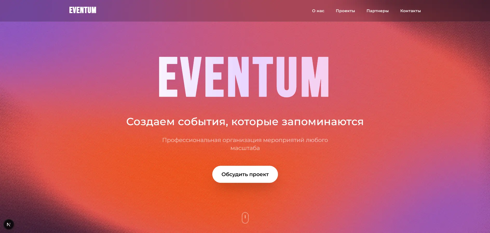
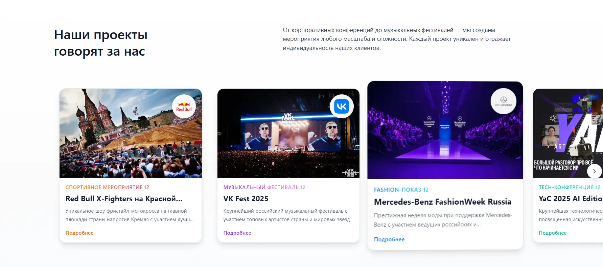
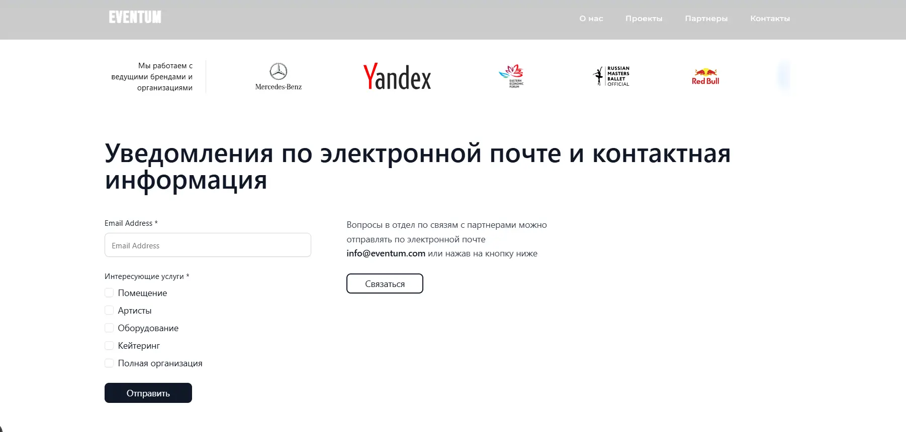
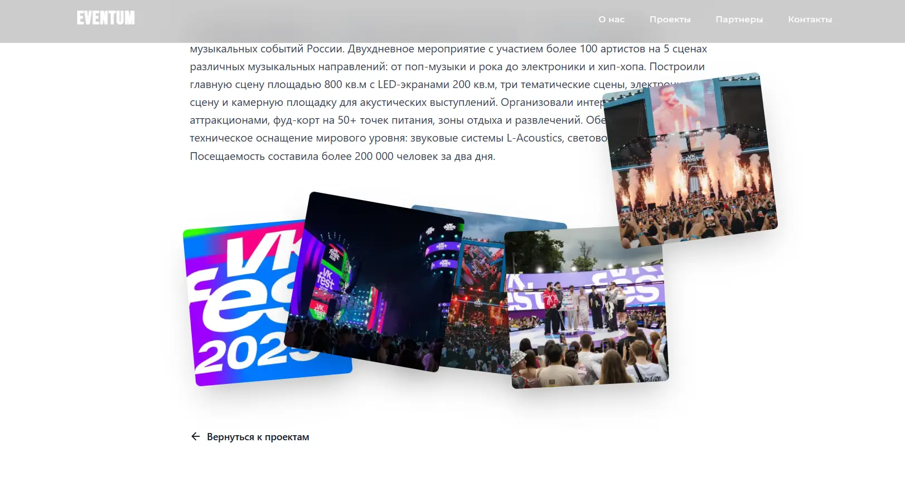
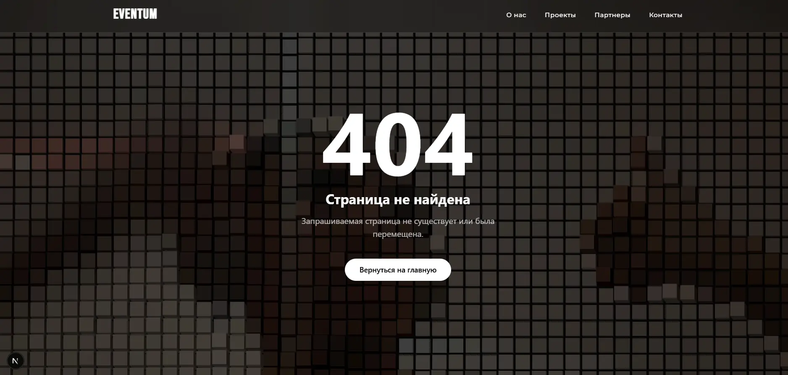
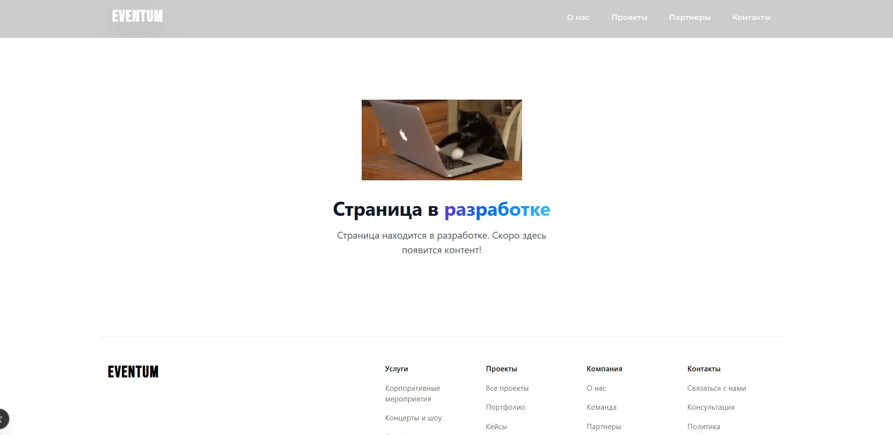

# Eventum Frontend

Фронтенд для лендинга ивент-индустрии на **Next.js 16**.

**Demo:** [eventum-frontend-fawn.vercel.app](https://eventum-frontend-fawn.vercel.app/)

Бэкенд (Strapi): [eventum-backend](https://github.com/ImbaSharikAnirum/eventum-backend)

---

## Скриншоты

---

Демо-проект лендинга для **ивент-индустрии** с динамическим управлением контентом через **Strapi CMS**.

Проект выполнен в рамках **тестового задания на позицию Middle+ Fullstack разработчика**  
с фокусом на:
- семантику и архитектуру кода
- UX-логику и интерактивность
- визуальную составляющую и анимации
- удобную и масштабируемую Strapi-админку

---

## Реализованный функционал

### Секции лендинга
- **Hero** — интерактивный Three.js liquid-градиент, GSAP-анимации, CTA
- **О компании** — анимированная статистика (NumberTicker)
- **Проекты** — горизонтальный слайдер, 3D-карточки, динамические страницы проектов
- **Партнёры** — бесконечная бегущая строка с progressive blur
- **Контакты** — интерактивная карта 2GIS, форма с валидацией, соцсети
- **Футер** — динамические группы ссылок из Strapi

### Страницы проектов
- Динамические маршруты: `/projects/[slug]`
- Галерея, расширенное описание, метаданные
- Плавные переходы и анимации

---

## Технологический стек

### Frontend
- **Next.js 16 (App Router)**
- **TypeScript**
- **Tailwind CSS v4**
- **GSAP** — скролл- и entrance-анимации
- **Three.js** — интерактивный фон
- **Framer Motion**
- **React Hook Form + Zod**
- SEO: Metadata API, JSON-LD

## Деплой

Проект настроен для деплоя на **Vercel**. Добавьте переменные окружения в настройках проекта.

---

## Связанные репозитории

- [eventum-backend](https://github.com/ImbaSharikAnirum/eventum-backend) — Strapi CMS бэкенд